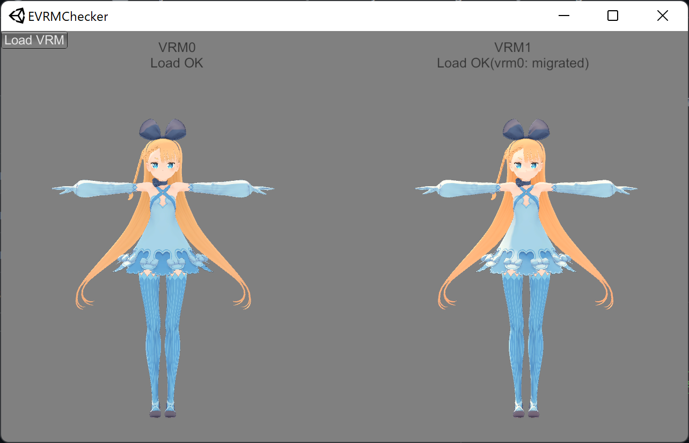
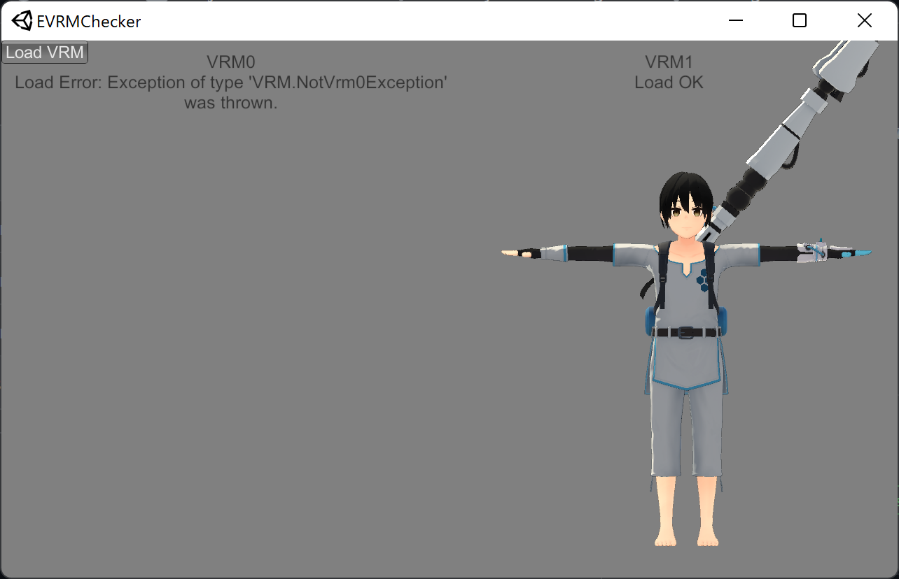
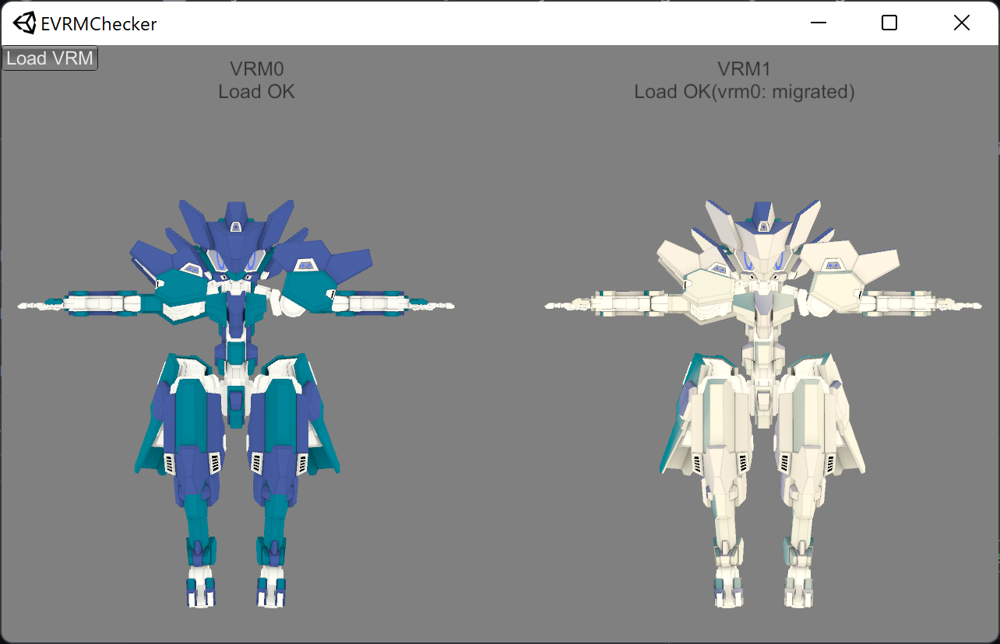
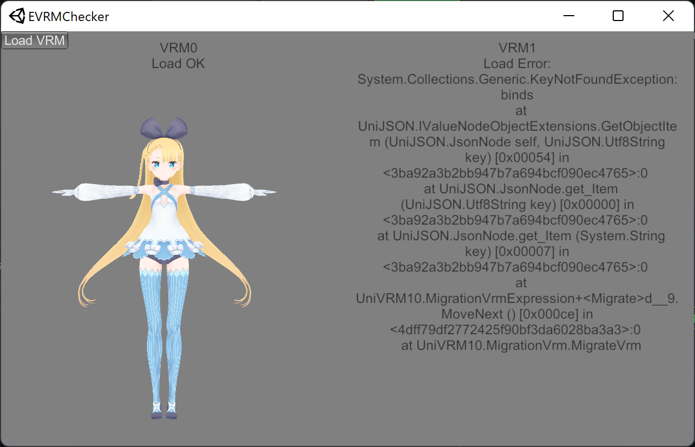

# EVRMChecker
VRMファイルが、

+ VRM0環境で読み込めるものか
+ VRM1環境で読み込めるものか

同時に読み込んで確認することができます。

とりあえず、「VRM読めないんですけどー」って言う人に確認してもらうためのツールです。

VRM0 = UniVRM-0.104.1_4a9b.unitypackage  
VRM1 = VRM-0.104.1_4a9b.unitypackage (VRM0読み込み有効)  
での読込結果です。

※モデルは付属しません。モデルの権利は各モデルの作者に帰属します。

VRM0正常  

VRM1正常(VRM0では読み込めません)  

VRM0と1で見た目が違う場合  

VRM1で読み込めない場合  

